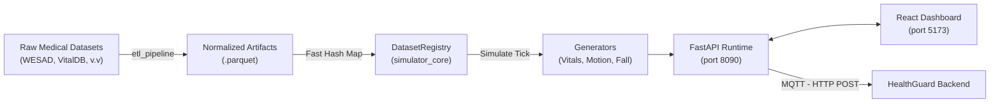

<p align="center">
  
</p>

# VSmartwatch / HealthGuard IoT Simulator

Đây là mô-đun **Giả lập Thiết bị Đeo tay (Smartwatch)** chuyên dụng phục vụ cho hệ sinh thái phân tích sức khỏe VSmartwatch / HealthGuard. Dự án này không hoạt động dựa trên các hàm sinh số ngẫu nhiên (synthetic random) truyền thống mà sử dụng nguồn **dữ liệu y sinh thực tế (Real Medical Datasets)** để đảm bảo tính hợp lệ lâm sàng cho toàn bộ pipeline dữ liệu telemetry.

---

## 1. Tổng Quan Dự Án

### Mục tiêu
- **Mô phỏng chân thực:** Tạo ra luồng dữ liệu sinh tồn (Nhịp tim, SpO2, Huyết áp, Nhịp thở) mang đầy đủ các đặc tính nhiễu vận động (motion artifacts) và biến thiên sinh lý đúng thực tế y khoa.
- **Phục vụ Kiểm thử:** Cung cấp nguồn Telemetry thời gian thực qua WebSockets/MQTT để stress test hệ thống Backend (HealthGuard) và Alert Engine (cảnh báo nguy hiểm, té ngã).
- **Graceful Fallback:** Tự động chuyển đổi giữa dữ liệu thực và dữ liệu tổng hợp dựa trên sự hiện diện của ổ đĩa cục bộ.

### Kiến trúc Hệ thống



---

## 2. Tính Năng Chính

- **Quản lý Vạn vật (IoT Fleet):** Khởi tạo, quản lý và chạy đồng thời hàng chục thiết bị (Devices) mang các session giả lập độc lập rẽ nhánh (Replay, Fall Scenario, Sleep).
- **Hash Indexing O(1) Data Retrieval:** Truy xuất dữ liệu từ hàng trăm nghìn dòng Parquet chỉ mất **0.001ms**, đảm bảo server không bottleneck khi scale up số lượng thiết bị.
- **Data Provenance:** Mỗi gói tin sinh ra đều có thẻ Nguồn (ví dụ: `spo2_source=real:VitalDB` hoặc `mock`) báo cáo minh bạch về nguồn gốc tín hiệu.
- **Tiêm Sự Cố Cấp Cứu (Fall Event Injection):** Tạo giả lập chuỗi sinh lý trước-trong-sau té ngã dựa trên đáp ứng rủi ro (Fight-or-flight response).
- **Dashboard Giám Sát Real-time:** Ứng dụng React cung cấp biểu đồ sinh lý trực tiếp, log stream theo dõi lưu lượng và Signal Provenance Panel phân tách nguồn dataset.

---

## 3. Danh Sách Field Simulator Cung Cấp

> 📋 **Xem đầy đủ tại: [docs/FEATURE_SPEC.md](docs/FEATURE_SPEC.md)**

Tài liệu `FEATURE_SPEC.md` là tham chiếu chính xác duy nhất cho mọi developer cần biết field nào simulator **thực sự phát ra**. Mỗi field được ghi rõ:
- Tên field chính xác trong payload
- Đơn vị đo
- Dataset nguồn
- Trạng thái phát sinh: **Luôn có** / **Có điều kiện** / **Backend tự tính** / **Chưa implement**
- Mô tả điều kiện và fallback cụ thể

| Domain | Số field luôn có | Xem chi tiết |
|--------|----------------|-------------|
| Sinh Hiệu — real-time @ 1 Hz | 10 field | [Mục 1 — Vital Signs](docs/FEATURE_SPEC.md#1-domain-sinh-hiệu-vital-signs) |
| Giấc Ngủ — per session | 18 field | [Mục 2 — Sleep](docs/FEATURE_SPEC.md#2-domain-giấc-ngủ-sleep) |
| Té Ngã — motion window @ 50 Hz | 7 field | [Mục 3 — Fall Detection](docs/FEATURE_SPEC.md#3-domain-té-ngã-fall-detection) |
| Té Ngã — fall event | 11 field | [Mục 3.2 — Fall Event](docs/FEATURE_SPEC.md#32-fall-event----sim_event_v1-phát-tại-thời-điểm-phát-hiện-ngã) |

---


## 4. Dữ Liệu & Nguyên Tắc Y Sinh

Hệ thống được thiết kế bằng việc **kết hợp chéo** các tập dữ liệu, trong đó mỗi tập chỉ đảm nhiệm đúng domain y khoa thế mạnh của nó.

### 4.1. Danh Sách Tập Dữ Liệu Lõi (Core Datasets)

| Tên Dataset | Chất Lượng | Domain Y Tế | Tín Hiệu Cung Cấp | Vai trò trong Giả lập |
|---|---|---|---|---|
| **PPG-DaLiA** | ⭐⭐⭐⭐ | Wearable HR | `heart_rate`, `accel` tay | Tín hiệu gốc chứa độ nhiễu vận động tự nhiên của người đeo smartwatch thật. |
| **PAMAP2** | ⭐⭐⭐⭐⭐ | Activity | `accel`, `gyro` 3 điểm | Profile gia tốc đặc trưng cho 18 hoạt động ADL hàng ngày. |
| **PIF_v3** | ⭐⭐⭐⭐ | Fall Bridge | Vitals post-fall | Nguồn duy nhất nối sự kiện ngã vật lý với phản ứng tim mạch sinh lý đi kèm. |
| **UP-Fall** | ⭐⭐⭐⭐ | Fall Motion | 10 mẫu té ngã | Đóng góp đa dạng các mẫu ngã (tiến, lùi, bay ngang) để test model AI. |
| **Sleep-EDF** | ⭐⭐⭐⭐⭐ | Giấc Ngủ | Giấc ngủ 5 chu kỳ | Cung cấp sơ đồ chu kỳ (Hypnogram) W/N1/N2/N3/REM thực tế suốt 8 tiếng. |
| **WESAD** | ⭐⭐⭐⭐ | Stress | Stress HR | Mô phỏng chính xác phân phối nhịp tim khi căng thẳng cao độ. |
| **VitalDB** | ⭐⭐⭐ | Clinical Vitals | C. SpO2, Huyết Áp | Mang số đo thực tế từ phòng ICU vào simulator thay vì tham số 98% tĩnh cứng. |
| **BIDMC** | ⭐⭐⭐⭐ | Respiration | Nhịp thở (RR) | Nguồn dữ liệu hô hấp trích xuất nhịp thở từ PPG cực chuẩn. |

### 4.2. Bảng Tiêu Chuẩn Y Tế Áp Dụng (Medical Constraints)

Mọi tín hiệu sinh tồn khi bật ra khỏi API đều bị chặn theo khung tiêu chuẩn **Hard Boundaries** của các tổ chức Y khoa thế giới. Bất cứ mức nào nằm ngoài "Normal" đều trigger cờ Warning/Critical xuống Backend.

| Chỉ số | Normal | Nguồn Y Khoa Trích Dẫn | Ý nghĩa |
|--------|--------|------------------------|---------|
| **HR (Nhịp tim)** | `60 - 100` bpm | **AHA 2020** *(American Heart Association)* | Bắt nhịp chậm/nhanh cấp cứu (<50 hoặc >=120). |
| **SpO2 (Oxy máu)** | `95% - 100%` | **WHO 2011** *(World Health Organization)* | Cảnh báo Hypoxemia (<90% máu thiếu Oxy). |
| **BP (Huyết áp)** | `< 120 / < 80` | **ACC/AHA 2017** *(High BP Guidelines)* | Bắt cơn khủng hoảng huyết áp (Sys>=180). |
| **RR (Nhịp thở)** | `12 - 20` rpm | **NEWS2 / ERS** *(European Respiratory Soc)* | Chỉ báo kịch trần suy hô hấp (<10 hoặc >25). |
| **Thân nhiệt** | `36.7 (±0.3)` | **Harrison's Principles of Internal Medicine** | Ngăn chặn lỗi null/trống cho tín hiệu nền. |

---

## 5. Changelog (Lịch sử Cập Nhật)

- **2026-04-27 (Module H — UX Overhaul + Backend Schema Fixes):**
  - **Dashboard Hero** (`SystemHealthHero`) — hiển thị trạng thái runtime/database/backend/modelApi theo `HealthPayloadV2`; retry CTA khi BE chưa sẵn sàng.
  - **Trung tâm Bằng chứng** (`VerificationPage`) — theo dõi tất cả phiên đang chạy song song (fan-out WebSocket per session), pipeline 3×2 grid, tên thiết bị thay vì raw ID.
  - **FallLab** — nút tiêm sự kiện té ngã/SOS đầy đủ variant, kết nối BE thật.
  - **Motion Preview** — giao diện operator-friendly với tiếng Việt, chi tiết kỹ thuật có thể thu gọn.
  - **Scenarios Page** — card compact expand-on-click, layout grid đồng đều.
  - **Backend fix** (`/api/sim/health`) — sửa `ResponseValidationError` do legacy `"backend"` key đè lên `HealthBackendBlock`; đổi key sang `"backendStatus"`.
  - **IPv6 latency fix** — thêm `.env.example`; đặt `HEALTH_BACKEND_URL=http://127.0.0.1:8000` tránh Windows DNS fallback ~2s.
  - **React Query persistence** — health payload được persist qua cold reload; `staleTime` 15s tránh spinner flash khi điều hướng.
  - **Pre-model trigger** — bổ sung `pre_model_trigger/` module với fall/sleep dispatch primitives (branch `feat/sleep-risk-dispatch`).

- **2026-04-02 (Sleep AI Integration):**
  - Tích hợp `SleepAIClient` → gọi HealthGuard AI ONNX API (`http://localhost:8001`) để chấm điểm giấc ngủ AI-driven.
  - Xây dựng `SleepVitalsEnricher` → sinh đủ 19 features/session cho 4 kịch bản ngủ (good/fragmented/apnea-mild/apnea-severe).
  - Bổ sung `BackfillSleep` API → inject lịch sử giấc ngủ N ngày (1-90) để nạp đủ data cho AI Risk Scoring.
  - Tạo `docs/FEATURE_SPEC.md` → tài liệu chi tiết 60 features theo 3 domain.
- **2026-03-27 (P09 Codebase Audit):**
  - Chuyển `DatasetRegistry` từ O(N) List Scan sang Hash Indexing O(1) → Giảm độ trễ `get_vitals` từ ~74ms xuống 0.001ms (Sẵn sàng Production).
  - Tối ưu `PIF_v3 ETL`, cạo sạch dead code (`fall_adjust`) và duplicate fields.
  - Ban hành Bảng tiêu chuẩn y tế rào tín hiệu theo AHA, WHO.
- **2026-03-27 (P08 - BIDMC):** Tích hợp thành công tín hiệu Nhịp thở (`respiration_rate`) từ kho dữ liệu ICU BIDMC.
- **2026-03-27 (P07 - VitalDB):** Gắn kết clinical SpO2 và Blood Pressure vào pipeline (thay vì synthetic mock).
- **2026-03-27 (P06 - WESAD):** Trích xuất Stress HR distribution thành công, thay thế hoàn toàn logic giả lập `+8bpm`.

---

## 6. Hướng dẫn sử dụng & Khởi động

> **Lưu ý:** Dataset thô không được push kèm trong Repository này do giới hạn kích thước.  
> Xem hướng dẫn tải: [`datasets/DOWNLOAD_GUIDE.md`](datasets/DOWNLOAD_GUIDE.md)

### Bước 0 — Cấu hình môi trường

```powershell
# Tạo .env từ template
Copy-Item .env.example .env
# Chỉnh sửa .env: điền DATABASE_URL và các giá trị cần thiết
notepad .env
```

> **Windows tip:** Đặt `HEALTH_BACKEND_URL=http://127.0.0.1:8000` (không dùng `localhost`) để tránh IPv6 resolution delay ~2s.

### Bước 1 — Chạy toàn bộ

```powershell
.\start_all.bat
```

### Bước 2 — Setup Frontend độc lập

```powershell
cd simulator-web
npm install
npm run dev
```

### Bước 3 — Tạo dữ liệu ngủ lịch sử (backfill)

```powershell
# Sau khi simulator đang chạy
curl -X POST http://localhost:8090/api/sim/scenarios/sleep/backfill `
  -H "Content-Type: application/json" `
  -d '{"device_id": "<id>", "days_behind": 30, "scenario_id": "good_sleep_night"}'
```

| Service | URL |
|---|---|
| Backend Engine (FastAPI) | `http://localhost:8090` |
| Web Dashboard (React) | `http://localhost:5173` |
| AI Inference (ONNX) | `http://localhost:8001` |
| HealthGuard Backend | `http://localhost:8000` |
